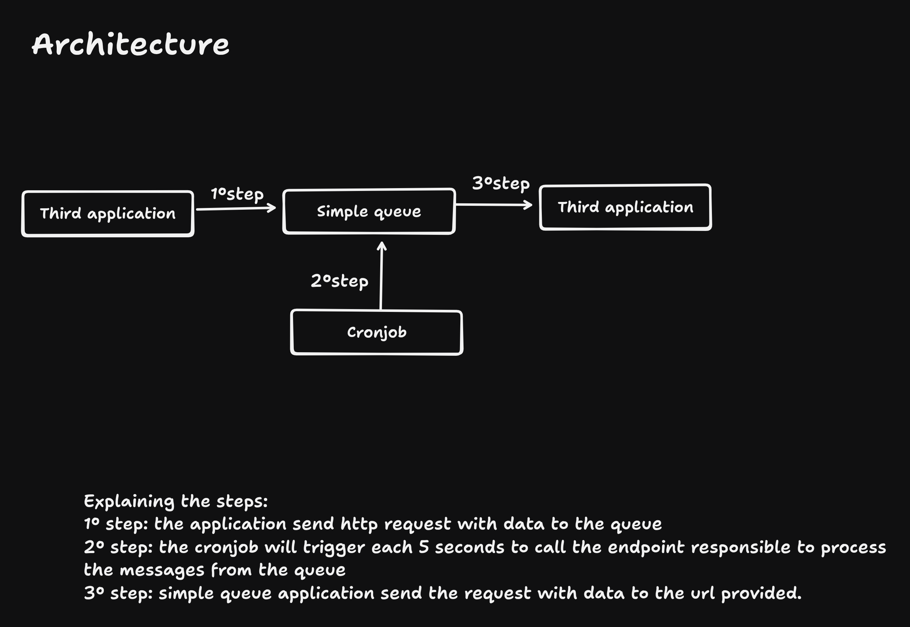

## ABOUT

- The project is a http request queue such as https://zeplo.io/ or Qstash from https://upstash.com/, but open source.

## TECHNOLOGIES

- Cloudflare workers
- Durable objects(Sqlite storage)
- Node.js
- Typescript
- Supbase(cronjob to trigger the consumer)

## HOW TO RUN

- Clone
- Execute command **npm install**
- Execute commnad **npm run dev** to run locally
- Execute command **npm run deploy** to deploy the queue on Cloudflare workers.
- Import the Insominia collection **Insomnia_2026-01-11.yaml**.

### HOW TO SETUP THE SCHEDULER

- Create a Supabase account
- Setup the cronjob on integration page
- Create a new cronjob
  - Add a name
  - Set the schedule to execute every 5 seconds
  - Type **SQL Snippet**
  - SQL snippet:
  ```sql
  select
  net.http_get(
      url:='YOUR_SIMPLE_QUEUE_APPLICATION_URL/process',
      headers:=jsonb_build_object('x-api-key', 'YOUR_API_KEY'),
      timeout_milliseconds:=60000
  );
  ```
  - Click on button to save

## ARCHITECTURE



## LOAD TEST

- You can find the load test script on folder **loadtest**

┌─────────┬────────┬─────────┬─────────┬─────────┬────────────┬───────────┬─────────┐
│ Stat │ 2.5% │ 50% │ 97.5% │ 99% │ Avg │ Stdev │ Max │
├─────────┼────────┼─────────┼─────────┼─────────┼────────────┼───────────┼─────────┤
│ Latency │ 497 ms │ 1418 ms │ 3297 ms │ 3606 ms │ 1440.77 ms │ 658.85 ms │ 3738 ms │
└─────────┴────────┴─────────┴─────────┴─────────┴────────────┴───────────┴─────────┘
┌───────────┬─────────┬─────────┬────────┬────────┬────────┬────────┬─────────┐
│ Stat │ 1% │ 2.5% │ 50% │ 97.5% │ Avg │ Stdev │ Min │
├───────────┼─────────┼─────────┼────────┼────────┼────────┼────────┼─────────┤
│ Req/Sec │ 61 │ 61 │ 255 │ 737 │ 384.62 │ 228.4 │ 61 │
├───────────┼─────────┼─────────┼────────┼────────┼────────┼────────┼─────────┤
│ Bytes/Sec │ 37.2 kB │ 37.2 kB │ 156 kB │ 450 kB │ 235 kB │ 139 kB │ 37.2 kB │
└───────────┴─────────┴─────────┴────────┴────────┴────────┴────────┴─────────┘

## ENV DETAILS:

```
"API_KEY": "api_key_here"         // The api key is used to protect the application
"HTTP_REQUEST_TIMEOUT": 10,       // The timeout in seconds the queue will wait before consider the request is invalid.
"TOTAL_RETRIES_BEFORE_DQL": 3,    // The total of times try to process the message before send to the dead letter queue.
"TOTAL_MESSAGES_PULL_PER_TIME": 4 // The total of messages pull of the queue and notify to the urls on same time.
```

## LIMITATIONS ON FREE TIER

- Durable objects menory has limit 128MB.
- Cloudflare workers allow 1000 request per minute.
- Durable object allow 100.000 writes per day. PS: each message is 1 write to storage, 1 write update the index and 1 write to remove the register after process the message

## Estimate cost for 1 million messages

- 1 million Cloudflare workers => $0.33 + 0.33(1 million requests to process messages)
- 1 million requests to Durable objects => $0.15(1 million save on queue) + $0.15(1 million operation process the messages from the queue)
- 1 million reads => $0.001
- 1 million writes => $1 + $1(1 million write to update the index table) + $1(1 million operation to delete the messages after processed with success)
- Total => $0.33 + 0.33 +$0.15 x 2 + $0.001 + $1 x 3 => +/-$4
